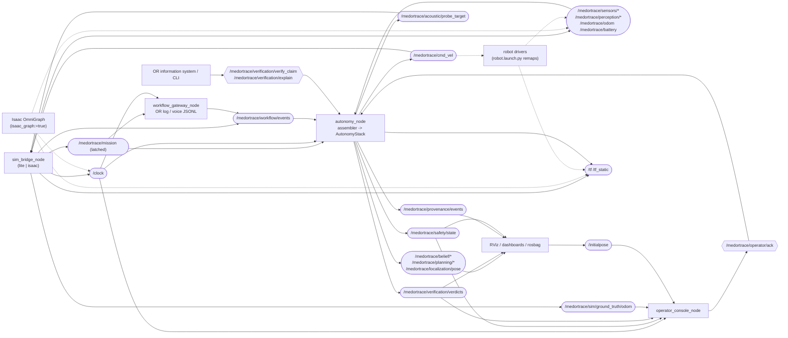
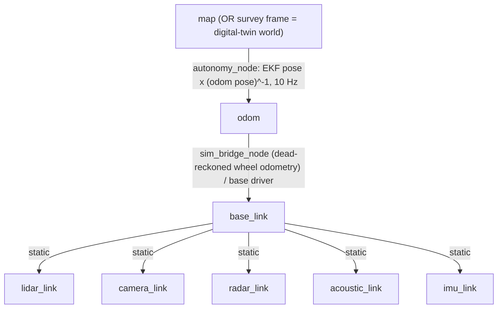

# MED-OR-TRACE ROS 2 message graph

The autonomy stack (`medortrace.autonomy.stack.AutonomyStack`) is middleware-agnostic: once per control
tick it takes a `medortrace.common.msgs.SensorBundle` and returns a safety-gated `VelocityCommand`. The
ROS 2 workspace (`ros2_ws/`, Humble and Jazzy) only moves data between topics and those dataclasses, so the
**same stack code** runs against:

| deployment | launch file | where the sensor data comes from | who owns time |
|---|---|---|---|
| lite simulator (laptop, CI) | `sim_lite.launch.py` | `sim_bridge_node --backend lite` | bridge publishes `/clock` (lockstep) |
| Isaac Sim digital twin | `isaac_sim.launch.py` | `sim_bridge_node --backend isaac` inside Isaac Sim's `python.sh` (optionally + OmniGraph) | bridge or OmniGraph `/clock` |
| physical prototype | `robot.launch.py` | real drivers, **remapped** onto the `/medortrace/...` topics | wall clock |

Packages:

* `medortrace_msgs` (ament_cmake + rosidl): 20 messages, 3 services, listed below.
* `medortrace_ros` (ament_python): the nodes `autonomy_node`, `sim_bridge_node`, `workflow_gateway_node` and
  `operator_console_node`, plus ROS-free modules: `assembler` (topics to `SensorBundle`), `records` (stack to
  publishable records), `mission` (`StackInputs` as JSON) and `frames` (rig TF). Also `convert`
  (ROS msg <-> dataclass, lazy ROS imports), the topic registry `topics` and the `qos` loader.

Topic names come from the single registry `medortrace_ros/topics.py`, which includes
`medortrace/isaac/ros2_bridge.py:TOPICS` unchanged. The registry asserts at import time, and the tests check,
that the two agree.

## Node / topic graph

Dashed edges are alternatives: the Isaac OmniGraph replaces the bridge for clock, TF, odometry and lidar
when `isaac_graph:=true`, and the drivers replace the bridge on the robot.

## Topics

QoS: R = reliable, BE = best effort, V = volatile, TL = transient local. The profile name is the key in
`medortrace_ros/config/qos.yaml`. Rates are the lite defaults (`sensors.rates_hz`).

| topic | type | QoS | rate | producer | consumer |
|---|---|---|---|---|---|
| `/clock` | `rosgraph_msgs/Clock` | R, V, depth 1 (`clock`) | 1/sim step | sim_bridge or Isaac OmniGraph | all nodes (use_sim_time) |
| `/tf` | `tf2_msgs/TFMessage` | R, V, depth 100 (`tf`) | 10 Hz | sim_bridge / base driver (odom->base_link), autonomy (map->odom) | rviz, drivers |
| `/tf_static` | `tf2_msgs/TFMessage` | R, TL (tf2 default) | once | `static_transform_publisher` from `configs/robot/rig.yaml` | rviz, drivers |
| `/medortrace/sensors/lidar/points` | `sensor_msgs/PointCloud2` | BE, V, depth 2 (`sensor_dense`) | 5 Hz | sim_bridge or Isaac RTX lidar or lidar driver | autonomy |
| `/medortrace/sensors/camera/rgb` | `sensor_msgs/Image` | BE, V, depth 2 (`sensor_dense`) | 5 Hz | Isaac OmniGraph or camera driver | detector (external), rviz |
| `/medortrace/sensors/camera/depth` | `sensor_msgs/Image` | BE, V, depth 2 (`sensor_dense`) | 5 Hz | Isaac OmniGraph or camera driver | detector (external) |
| `/medortrace/sensors/camera/camera_info` | `sensor_msgs/CameraInfo` | BE, V, depth 5 (`sensor_data`) | 5 Hz | Isaac OmniGraph or camera driver | detector (external) |
| `/medortrace/perception/camera/detections` | `medortrace_msgs/CameraDetectionArray` | BE, V, depth 5 (`sensor_data`) | 5 Hz | sim_bridge or detector | autonomy |
| `/medortrace/perception/landmarks` | `medortrace_msgs/LandmarkObservationArray` | BE, V, depth 5 (`sensor_data`) | 5 Hz | sim_bridge or fiducial detector | autonomy |
| `/medortrace/sensors/radar/detections` | `medortrace_msgs/RadarDetectionArray` | BE, V, depth 5 (`sensor_data`) | 10 Hz | sim_bridge or radar adapter | autonomy |
| `/medortrace/sensors/radar/points` | `sensor_msgs/PointCloud2` | BE, V, depth 5 (`sensor_data`) | 10 Hz | radar driver (physical robot) | autonomy (`radar.input: pointcloud2`) |
| `/medortrace/sensors/acoustic/echoes` | `medortrace_msgs/AcousticFrame` | BE, V, depth 5 (`sensor_data`) | 2 Hz while probing | sim_bridge or acoustic probe driver | autonomy |
| `/medortrace/sensors/imu` | `sensor_msgs/Imu` | BE, V, depth 50 (`sensor_data`) | 100 Hz | sim_bridge or IMU driver | autonomy |
| `/medortrace/odom` | `nav_msgs/Odometry` | BE, V, depth 5 (`sensor_data`) | 10 Hz | sim_bridge or Isaac OmniGraph or base driver | autonomy |
| `/medortrace/sensors/contact` | `medortrace_msgs/ContactState` | BE, V, depth 5 (`sensor_data`) | 10 Hz | sim_bridge or bumper / arm driver | autonomy |
| `/medortrace/battery` | `sensor_msgs/BatteryState` | BE, V, depth 5 (`sensor_data`) | 1-10 Hz | sim_bridge or BMS driver | autonomy |
| `/medortrace/workflow/events` | `medortrace_msgs/WorkflowEvent` | R, TL, depth 1000 (`events`) | sporadic | sim_bridge or workflow_gateway | autonomy |
| `/medortrace/workflow/transcript` | `std_msgs/String` | R, TL, depth 500 (`events`) | sporadic | workflow_gateway | audit / rosbag |
| `/medortrace/mission` | `std_msgs/String` (JSON) | R, TL, depth 1 (`latched`) | once | sim_bridge, facility server, or autonomy (re-publishes file missions) | autonomy (`mission_source: topic`), workflow_gateway (t0) |
| `/medortrace/cmd_vel` | `geometry_msgs/Twist` | R, V, depth 1 (`command`) | 10 Hz | autonomy (safety-gated) | sim_bridge or Isaac OmniGraph or base driver |
| `/medortrace/acoustic/probe_target` | `std_msgs/String` | R, V, depth 1 (`command`) | 10 Hz | autonomy | sim_bridge or acoustic probe driver |
| `/medortrace/localization/pose` | `geometry_msgs/PoseWithCovarianceStamped` | R, V, depth 5 (`state_volatile`) | 10 Hz | autonomy | rviz |
| `/medortrace/belief/items` | `medortrace_msgs/ItemBeliefArray` | R, TL, depth 1 (`state`) | 2 Hz | autonomy | dashboards, rosbag |
| `/medortrace/belief/scene_graph` | `medortrace_msgs/SceneGraph` | R, TL, depth 1 (`state`) | 1 Hz | autonomy | dashboards, rosbag |
| `/medortrace/belief/uncertainty` | `medortrace_msgs/UncertaintyGrid` | R, TL, depth 1 (`state`) | 1 Hz | autonomy | dashboards, rosbag |
| `/medortrace/belief/occupancy` | `nav_msgs/OccupancyGrid` | R, TL, depth 1 (`state`) | 1 Hz | autonomy | rviz |
| `/medortrace/planning/nbv` | `medortrace_msgs/NextBestView` | R, TL, depth 1 (`state`) | on change | autonomy | dashboards, rosbag |
| `/medortrace/planning/path` | `nav_msgs/Path` | R, TL, depth 1 (`state`) | on change | autonomy | rviz |
| `/medortrace/verification/verdicts` | `medortrace_msgs/ClaimVerdict` | R, TL, depth 2000 (`audit`) | sporadic | autonomy | operator_console, OR information system |
| `/medortrace/provenance/events` | `medortrace_msgs/ProvenanceEvent` | R, TL, depth 2000 (`audit`) | ~10-40 Hz | autonomy | audit logger, rosbag |
| `/medortrace/safety/state` | `medortrace_msgs/SafetyState` | R, TL, depth 1 (`state`) | 10 Hz | autonomy | operator_console, rviz |
| `/diagnostics` | `diagnostic_msgs/DiagnosticArray` | R, V, depth 5 (`state_volatile`) | 1 Hz | autonomy (assembler health), sim_bridge | rqt_robot_monitor |
| `/medortrace/sim/ground_truth/odom` | `nav_msgs/Odometry` | R, V, depth 5 (`state_volatile`) | 10 Hz | sim_bridge (simulation only) | operator_console (auto mode), evaluation |
| `/initialpose` | `geometry_msgs/PoseWithCovarianceStamped` | R, V, depth 1 (`command`) | sporadic | RViz "2D Pose Estimate" | operator_console (rviz mode) |

Services (all served by `autonomy_node`):

| service | type | client | purpose |
|---|---|---|---|
| `/medortrace/operator/ack` | `medortrace_msgs/OperatorAck` | operator_console | acknowledge a HANDOVER, optionally re-localise (`AutonomyStack.operator_intervention`) |
| `/medortrace/verification/verify_claim` | `medortrace_msgs/VerifyClaim` | OR system / CLI | queue an ad-hoc claim "item is in slot at t_ref"; the verdict arrives on `/verdicts` |
| `/medortrace/verification/explain` | `medortrace_msgs/ExplainVerdict` | OR system / CLI | supporting / contradicting evidence (`ProvenanceGraph.explain`) and the item's custody chain |

## Message <-> dataclass mapping

| ROS 2 | medortrace (`medortrace/common/msgs.py` unless noted) | notes |
|---|---|---|
| `sensor_msgs/PointCloud2` | `LidarScan` | one point per **ray**; fields `x y z intensity ring range dir_x dir_y dir_z` (+ `gt_ghost gt_object` in simulation); no-return rays have `range = inf`, `x y z = NaN`. Clouds without `dir_*` fields (drivers, Isaac RTX helper) are converted from `x y z`, and the missing rays of the scan pattern can be re-created (`lidar.fill_no_return_rays`) |
| `medortrace_msgs/CameraDetectionArray` / `CameraDetection` / `SurfaceObservation` | `CameraFrame` / `CameraDetection` / `surfaces` | `class_names` gives the logit order; logits are re-ordered to the stack's `CLASSES` |
| `medortrace_msgs/RadarDetectionArray` / `RadarDetection` | `RadarFrame` / `RadarDetection` | or a radar driver `PointCloud2` (x, y, z, velocity, intensity) with `radar.input: pointcloud2` |
| `medortrace_msgs/AcousticFrame` / `AcousticEcho` | `AcousticFrame` / `AcousticEcho` | `gt_hard_reflector`: -1 unknown, 0, 1 |
| `medortrace_msgs/LandmarkObservationArray` / `LandmarkObservation` | `LandmarkFrame` / `LandmarkObservation` | |
| `medortrace_msgs/ContactState` | `ContactState` | |
| `sensor_msgs/Imu` | `ImuSample` | one message per sample (10 per 0.1 s tick in simulation) |
| `nav_msgs/Odometry` | `WheelOdometry` (+ odom-frame pose for the map->odom TF) | `twist.linear.x`, `twist.angular.z` |
| `sensor_msgs/BatteryState` | `SensorBundle.battery_wh` | `charge x voltage`, else `percentage x battery.capacity_wh` |
| `medortrace_msgs/WorkflowEvent` | `WorkflowEvent` | `header.stamp` = event time; `payload_json`; `source` or_log / voice / sim |
| `geometry_msgs/Twist` + `std_msgs/String` probe target | `VelocityCommand` | `acoustic_probe_target` travels on `/medortrace/acoustic/probe_target` ("" = none) |
| `medortrace_msgs/ItemBeliefArray` / `ItemBelief` | `belief.items.ItemBelief` | one slot list per array; per item `probabilities`, MAP slot, entropy, last tag read |
| `medortrace_msgs/ClaimVerdict` | `provenance.verifier.VerdictRecord` + `ProvenanceGraph.explain` | VERIFIED=0 REFUTED=1 ABSTAIN=2; evidence ids and log-likelihood weights; hash of the verdict node |
| `medortrace_msgs/ProvenanceEvent` | `provenance.graph.Node` | `index, prev_hash, hash, json_attrs, t` suffice to re-verify the chain (`records.verify_provenance_stream`) |
| `medortrace_msgs/SafetyState` | `safety.supervisor` mode + `SafetyInputs` signals | modes NOMINAL=0 .. HANDOVER=4 (same codes as `data/writer.py:MODE_CODE`) |
| `medortrace_msgs/NextBestView` | `planning.nbv.ViewGoal` | `Pose2D` pose, `nav_msgs/Path`, score breakdown as key / value arrays |
| `medortrace_msgs/SceneGraph` | `belief.scene_graph.build_scene_graph` | JSON |
| `medortrace_msgs/UncertaintyGrid` | `OccupancyBelief.uncertainty_field()` | float32 bits, `nav_msgs/MapMetaData` layout (row-major, x fastest) |

## Time and synchronisation

* **Mission time.** The stack runs on seconds since the case started. Claim deadlines, workflow event times
  and `StackInputs.duration` all use this clock. ROS stamps are absolute: `mission = ros_time - t0`. The
  origin `t0` is part of the mission document. In simulation `t0 = clock_offset_s` (default 100 s), so
  time 0 is never confused with "no /clock yet". With the Isaac OmniGraph clock, `t0 = 0`. On the robot
  `t0` is the mission file's value or the node start time, and the autonomy node re-publishes the mission
  with the resolved `t0` so that the workflow gateway shares it.
* **Two stamps per message.** The converter keeps the sensor's own stamp in `Header.stamp` and puts the node
  clock at callback time in `Header.recv_stamp`. It never replaces one with the other, so the stack's
  `TimeSyncMonitor` still detects skewed sensor clocks and re-times their data.
* **Assembly** (`medortrace_ros/assembler.py`) at the control rate (10 Hz):

  | channel | semantics | max receive age (default) |
  |---|---|---|
  | lidar, camera, radar, acoustic, landmarks | consume-once: newest message since the last tick, delivered at most once (evidence must not be double counted) | 0.5, 0.5, 0.3, 1.0, 0.5 s |
  | odom, contact, battery | sample-and-hold within the max age, then withheld so the stack sees the dropout; contact latches the strongest hit between ticks | 0.25, 0.25, 60 s |
  | imu | every sample received since the last tick, in stamp order | 0.5 s |
  | workflow | every event exactly once, de-duplicated on `event_id` (transient-local replays), in event-time order | unbounded |

  If the clock jumps backwards (simulation restart), all buffers are reset. Every delivered header gets a
  session-unique `seq`, because the stack names its provenance evidence `<sensor>:<seq>` and ROS 2 headers
  have no sequence number.
* **Lockstep simulation.** The bridge advances one `episode.dt` step only after the autonomy node has
  answered the previous step on `/medortrace/cmd_vel`, or after `lockstep_timeout_s` of wall time. Before
  the first step it waits until `/medortrace/cmd_vel` has a publisher. While its required channels are
  still silent, the autonomy node publishes zero commands, which keeps lockstep moving. The same seed is
  the same experiment as `medortrace.eval.runner.run_episode`: `mission.episode_config` applies the same
  config merges. The autonomy stack sees the same messages, but the first simulator step runs before the
  first command, so trajectories are not bit-identical. The in-process runner stays the reference for
  benchmark numbers. The tests replay a lite episode message by message through the assembler into the
  stack and get the in-process commands exactly.

## TF frame tree

The static extrinsics come from `configs/robot/rig.yaml` (`frames`). The same file is the single source for
the USD rig and the lite simulator's mount parameters. The launch files publish them with
`tf2_ros static_transform_publisher` (`medortrace_ros.launch_utils.rig_static_tf_nodes`). `base_link` is
the floor-level footprint centre, x forward, z up (REP 103/105). Rotations use fixed-axis roll/pitch/yaw.

| child of `base_link` | xyz [m] | rpy [deg] | sensor |
|---|---|---|---|
| `lidar_link` | 0.10, 0.00, 0.90 | 0, 0, 0 | RTX lidar OR16 (16 ch, +-15 deg) |
| `camera_link` | 0.00, 0.00, 1.45 | 0, 25, 0 (pitched down) | RTX RGB-D camera, 90 deg HFOV |
| `radar_link` | 0.25, 0.00, 0.60 | 0, 0, 0 | 77 GHz short-range radar |
| `acoustic_link` | 0.10, 0.00, 1.20 | 0, 0, 0 | active acoustic probe |
| `imu_link` | 0.00, 0.00, 0.20 | 0, 0, 0 | IMU |

The stack models each sensor by its rig mount, not by a TF lookup. Driver `frame_id`s therefore have to be the
rig's `*_link` names, or be aliased by a static transform. Image topics conventionally use an optical frame
(`camera_link` -> `camera_optical_frame`, rpy -90, 0, -90 deg). Only the external detector uses it, because
detections are published in `camera_link`. With `isaac_graph:=true` the OmniGraph publishes the robot and
sensor frames itself, under the stage's world frame, and the launch file does not re-publish the rig TF.

## QoS rationale

* **Sensor data** is best-effort, volatile, with a shallow history (depth 2-5; IMU 50). A late scan is worth
  less than a fresh one, and the assembler uses only the newest message per tick anyway. Best-effort
  subscribers also accept both best-effort and reliable driver publishers, so no driver QoS change is
  needed on the robot.
* **Verdicts and provenance** are reliable and transient-local with depth 2000. They are the audit record:
  dropping one breaks the hash chain on the receiving side. A late joiner (OR dashboard, audit logger,
  restarted console) gets the history.
* **Workflow events** are reliable and transient-local with depth 1000. They are reports that must not be
  lost, and a restarted autonomy node must receive the case so far; `event_id` de-duplication makes the
  replay harmless.
* **Mission and current state** (safety state, beliefs, maps, NBV, path) are reliable and transient-local
  with depth 1. This gives latched-topic semantics: a late joiner immediately has the latest value.
* **Commands** are reliable and volatile with depth 1. A reliable publisher is compatible with reliable and
  best-effort subscribers (e.g. the OmniGraph twist subscriber). A stale velocity command is never
  replayed to a late joiner.
* External publishers into a transient-local topic (e.g. an OR system publishing workflow events) must
  also be transient-local. A volatile publisher is incompatible with a transient-local subscription.

## Simulation -> physical robot

`robot.launch.py` changes only the middleware edge. The autonomy node's inputs and outputs are
remapped onto the drivers' topics (defaults below; override per platform). Nothing is republished.

| stack topic | launch argument | default driver topic | driver message |
|---|---|---|---|
| `/medortrace/sensors/lidar/points` | `lidar_topic` | `/ouster/points` | `sensor_msgs/PointCloud2` (no-return rays re-created from the OR16 pattern) |
| `/medortrace/perception/camera/detections` | `camera_detections_topic` | `/detector/detections` | `medortrace_msgs/CameraDetectionArray` (on-robot detector) |
| `/medortrace/perception/landmarks` | `landmarks_topic` | `/fiducials/observations` | `medortrace_msgs/LandmarkObservationArray` |
| `/medortrace/sensors/radar/detections` | `radar_topic` | `/radar/detections` | `medortrace_msgs/RadarDetectionArray` (`radar_input:=detections`) |
| `/medortrace/sensors/radar/points` | `radar_points_topic` | `/radar/points` | `sensor_msgs/PointCloud2` x, y, z, velocity, intensity (`radar_input:=pointcloud2`, default) |
| `/medortrace/sensors/acoustic/echoes` | `acoustic_topic` | `/acoustic_probe/echoes` | `medortrace_msgs/AcousticFrame` |
| `/medortrace/acoustic/probe_target` (output) | `acoustic_probe_topic` | `/acoustic_probe/target` | `std_msgs/String` |
| `/medortrace/sensors/imu` | `imu_topic` | `/imu/data` | `sensor_msgs/Imu` |
| `/medortrace/odom` | `odom_topic` | `/odom` | `nav_msgs/Odometry` (the driver also publishes odom->base_link TF) |
| `/medortrace/sensors/contact` | `contact_topic` | `/bumper/contact` | `medortrace_msgs/ContactState` |
| `/medortrace/battery` | `battery_topic` | `/battery_state` | `sensor_msgs/BatteryState` |
| `/medortrace/cmd_vel` (output) | `cmd_vel_topic` | `/cmd_vel` | `geometry_msgs/Twist` (already safety-gated) |

Other differences on the robot:

| | simulation | physical robot |
|---|---|---|
| clock | `/clock` from the bridge (`use_sim_time`) | wall clock |
| mission | latched `/medortrace/mission` from the bridge | `mission_file:=...` (JSON/YAML, `medortrace_ros/mission.py`); re-published latched |
| camera | detector surrogate inside the simulator | trained detector node publishing `CameraDetectionArray` |
| workflow | simulator's OR log (or gateway replay) | `workflow_gateway_node mode:=follow` tailing the live OR log / voice transcript, or the OR system publishing directly |
| operator | `operator_console mode:=auto` (simulated operator with ground-truth relocalisation) | `mode:=rviz` (2D Pose Estimate) or `mode:=interactive` |
| rig TF | static publishers from `rig.yaml` | same, or `publish_rig_tf:=false` with a URDF |
| ground truth | `/medortrace/sim/ground_truth/odom` | none |

## Isaac Sim

* `isaac_sim.launch.py` (default) runs `python.sh -m medortrace_ros.sim_bridge_node --backend isaac`.
  `IsaacBackend` renders the RTX sensors, applies the fault model and drives the wheels from the command.
  The bridge publishes exactly the lite topic set, in lockstep.
* With `isaac_graph:=true` the OmniGraph of `medortrace.isaac.ros2_bridge` is also built, through
  `IsaacBackend.add_reset_hook(ros2_reset_hook(drive_from_cmd_vel=False))`. The graph then publishes
  clock, TF, odometry, the RTX lidar cloud and RGB/depth/camera_info, and the bridge skips those topics.
  The wheels keep a single controller.
* Alternatively, `scripts/isaac/ros2_sim.py --bridge medortrace_ros.sim_bridge_node:create` drives the
  robot through the OmniGraph twist subscriber (`drive="external"`). The `create(backend)` factory then
  publishes only the custom-message topics of each bundle.
* The Isaac process needs `rclpy` and `medortrace_msgs` built for Isaac's Python version (see the package
  README).
